# 💫 Harsh Upadhyay | MERN Stack Architect

<div align="center">
  
  <!-- Typing Animation -->
  [](https://git.io/typing-svg)
  
  <!-- Profile Views Counter with Animation -->
  
  
  <!-- Dynamic Badges -->
  
  
  
</div>

<br/>

<!-- Hero Banner -->
<div align="center">
  
</div>

## 🚀 About Me


```javascript
const harsh = {
    location: "Mumbai, India 🇮🇳",
    education: "Computer Engineering @ VCET (2022-2026)",
    currentFocus: "MERN Stack Development & AI Integration",
    passion: "Building scalable solutions that impact lives",
    philosophy: "Code with purpose, innovate with passion",
    lifeGoal: "Democratize technology for everyone",
    funFact: "I debug with console.log and I'm proud of it! 😄"
};

// Current Mission
console.log("Building the future, one commit at a time! 🚀");
```

<br/>

## 🔥 Current Projects & Learning

<table>
<tr>
<td width="50%">

### 🏃‍♂️ What I'm Working On
- 🤸‍♂️ **Gymnastics Injury Prediction** - AI-powered web app for injury risk assessment
- 🏠 **Real Estate Multilingual Chat** - Breaking language barriers in property dealings
- 📚 **Second Ed Resource Hub** - Making education affordable through resource sharing

</td>
<td width="50%">

### 🌱 Currently Learning
- 🧠 **Artificial Intelligence & Machine Learning**
- 📊 **Advanced Data Structures & Algorithms** 
- ⚡ **Performance Optimization & Scalability**
- 🔐 **Cybersecurity Best Practices**

</td>
</tr>
</table>

<br/>

## 🛠️ Tech Arsenal

<div align="center">

### 💻 Programming Languages
<div>
  
</div>

### 🎨 Frontend Technologies  
<div>
  
</div>

### ⚙️ Backend & Database
<div>
  
</div>

### 🤖 AI/ML & Data Science
<div>
  
  
  
</div>

### 🛠️ Tools & Platforms
<div>
  
</div>

</div>

<br/>

## 📊 Performance Analytics

<div align="center">
  
  
  
  
</div>

<div align="center">
  
</div>

<!-- Activity Graph -->
<div align="center">
  
</div>

<br/>

## 🏆 GitHub Achievements

<div align="center">
  
  <!-- Trophy -->
  
  
</div>

<br/>

## 💼 Featured Projects

<div align="center">

[](https://github.com/Harsh-Upadhyay23/real-estate-multi-lang-chat)

</div>

### 🔗 Real Estate Multilingual Chat App
> **Breaking language barriers in real estate communication**
- 🌐 **Real-time multilingual translation** for seamless client-agent communication
- 💾 **SQL database integration** for persistent chat history and user management  
- 📄 **PDF export functionality** for important conversations and agreements
- 🎨 **Modern, responsive UI** built with React and advanced CSS animations
- ⚡ **WebSocket implementation** for instant message delivery

### 📚 Second Ed Resource Hub  
> **Democratizing education through affordable resource sharing**
- 🛒 **Full e-commerce functionality** for buying and selling study materials
- 🔍 **Advanced search and filtering** by subject, semester, and condition
- 👤 **User authentication & profile management** with purchase history
- 💳 **Secure payment integration** for safe transactions
- 📱 **Mobile-responsive design** for access on any device

<br/>

## 🎯 2024 Goals & Vision

```mermaid
graph TD
    A[🎯 Master Advanced React Patterns] --> B[⚡ Build High-Performance Apps]
    B --> C[🤖 Integrate AI/ML in Web Apps]
    C --> D[🌍 Launch SaaS Product]
    D --> E[👥 Contribute to Open Source]
    E --> F[🚀 Tech Leadership Role]
    
    style A fill:#00D9FF,stroke:#fff,color:#000
    style F fill:#FFD700,stroke:#fff,color:#000
```



<div align="center">

### 🎪 Fun Zone

<details>
<summary>🎮 Click for some developer humor!</summary>

```
Q: How many programmers does it take to change a light bulb?
A: None. It's a hardware problem.

Q: Why do programmers prefer dark mode?
A: Because light attracts bugs! 🐛
```

**My Coding Playlist Mood:**
- 🎵 Debug Mode: Lo-fi Hip Hop
- 🎵 Feature Development: Electronic/Synthwave  
- 🎵 Code Review: Classical Music
- 🎵 Deploy Day: Heavy Metal 🤘

</details>

</div>

<br/>

## 🌐 Connect & Collaborate

<div align="center">
  
  **Let's build something amazing together!**
  
  [](mailto:upadhyayharsh435@gmail.com)
  [](https://twitter.com/57_HarshUpadhyay)
  [](https://linkedin.com/in/harsh-upadhyay23)
  [](https://harsh-portfolio.dev)
  
  ### 💬 Ask me about:
  **MERN Stack** • **AI/ML Integration** • **Database Design** • **System Architecture** • **Code Optimization**
  
</div>

<br/>

## 💡 Random Dev Quote

<div align="center">
  
  
  
</div>

---

<div align="center">
  
  <!-- Snake Animation -->
  <picture>
    <source media="(prefers-color-scheme: dark)" srcset="https://raw.githubusercontent.com/Harsh-Upadhyay23/Harsh-Upadhyay23/output/github-contribution-grid-snake-dark.svg">
    <source media="(prefers-color-scheme: light)" srcset="https://raw.githubusercontent.com/Harsh-Upadhyay23/Harsh-Upadhyay23/output/github-contribution-grid-snake.svg">
    
  </picture>
  
  <!-- Footer -->
  
  
  **✨ "Code is like humor. When you have to explain it, it's bad." - Cory House ✨**
  
  
  
  
</div>
